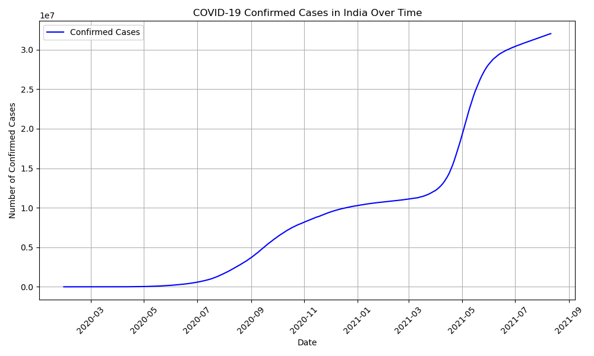

# COVID-19 Data Visualization Project

This project visualizes COVID-19 confirmed cases in India over time using Matplotlib.

## Dataset
Source: [COVID-19 in India by sudalairajkumar](https://www.kaggle.com/datasets/sudalairajkumar/covid19-in-india)

## Files
- `covid_visualization.ipynb`: Jupyter Notebook with code for loading, preprocessing, and plotting data.
- `covid_19_india.csv`: Dataset used for visualization (optional, if uploaded).
- `cases_over_time.png`: Line plot of confirmed cases over time.

## How to Run
1. Install dependencies: `pip install matplotlib pandas numpy`
2. Open `covid_visualization.ipynb` in Jupyter Notebook.
3. Run all cells to generate the plot.

## Plot Example

## Requirements
- Python 3.11+
- Libraries: matplotlib, pandas, numpy
- Jupyter Notebook

## Author
[Poshith]
